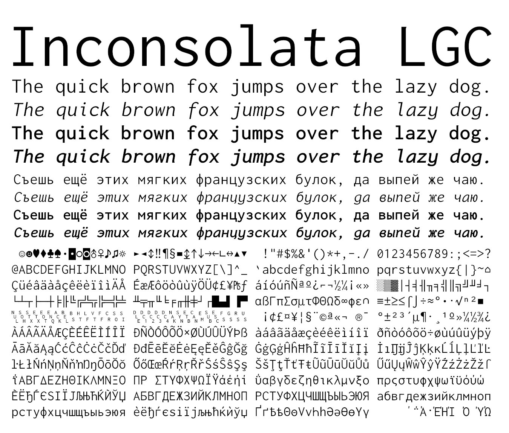
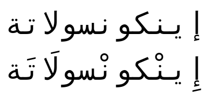
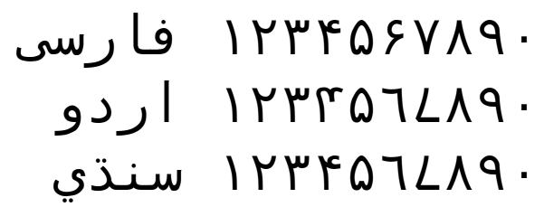
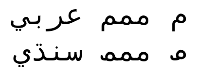
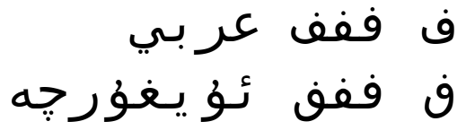
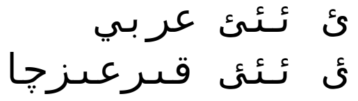

Inconsolata EX
==============

Inconsolata is one of the most suitable font for programmers created by Raph
Levien. Since the original Inconsolata does not contain Cyrillic alphabet,
it was slightly inconvenient for not a few programmers from Russia.

Inconsolata LGC is a modified version of Inconsolata with added the Cyrillic
alphabet which directly descends from Inconsolata Hellenic supporting modern
Greek.

Inconsolata EX is an expanded version of Inconsolata LGC and supports Arabic
script. Since this is beyond LGC, I had to give the new name.

Arabic script
-------------
Arabic glyphs are derived from the public domain part of DejaVu Sans Mono.

Regional forms
--------------
Inconsolata EX supports OpenType `locl` feature to display langauge-specific
variants.

### Arabic-Indic digits ###

While Persian Arabic-Indic digits are encoded separately from the standard
(Arabic language) ones, Urdu or Sindhi ones are not. In Urdu or Sindhi, some
glyphs of Arabic-Indic digits differ from Persian.

### Sindhi _meem_ ###

Arabic letter _meem_ has variants with long or short tail; the latter is
preferred for Sindhi.

### Central Asian _feh_ ###

In Kazakh, Kyrgyz, or Uyghur language, the letter _feh_ is preferred to be
shown with the skeleton of _qaf_ which is identical to Maghrebi _qaf_.
This is already encoded in U+06A7 and this character is preferred, but
existing text may use ordinary U+0641. This feature is included
for compatibility.

### Kyrgyz form of _yeh_ with _hamza_ ###

In Kyrgyz, _hamza_ is placed differently above _yeh_.

Miscellaneous variants
----------------------

### Tail fragment ###
Tail fragment (U+FE73) is intended for compatibility with certain legacy
character sets. If this character is preceded by _seen_, _sheen_, _sad_, or
_dad_, the preceding character is truncated and connected with this character.
