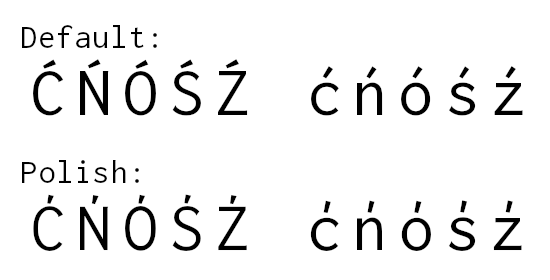

Inconsolata LGC
===============

Inconsolata is one of the most suitable font for programmers created by Raph
Levien. Since the original Inconsolata does not contain Cyrillic alphabet,
it was slightly inconvenient for not a few programmers from Russia.

Inconsolata LGC is a modified version of Inconsolata with added the Cyrillic
alphabet which directly descends from Inconsolata Hellenic supporting modern
Greek.

Inconsolata LGC changes
-----------------------
* Cyrillic glyphs and additional symbols added.
* Italic and Bold font added.

### Changes inherited from Inconsolata Hellenic
* Greek glyphs.

### Changes inherited from Inconsolata-dz:
* Straight quotation marks.

Regional forms
--------------
Inconsolata LGC supports OpenType `locl` feature to display Polish,
Romanian, Bulgarian, Macedonian, and Serbian specific variant (for the
latter two, affects to italic only). TTC version is intended for use in
apps which do not support `locl` feature.

### Polish _kreska_ ###

Polish _kreska_ looks steeper than acute accent.

### Romanian comma accent ###

Romanian alphabet has S and T with comma below, not with cedilla. The `locl`
feature for Romanian is included for compatibility: Romanian
language-specific _font itself_ is _not_ included in TTC. Use codepoints in
Latin Extended B.

### Bulgarian variant ###

Bulgarian Cyrillic alphabet overall looks more round than Russian one. Some
of them look like italic forms made upright. _El_ looks like uppercase lambda
and uppercase _De_ like delta with descender. Lowercase _ve_, _zhe_, _ka_,
and _yu_ have ascenders and _ze_ has descender.

### Serbian and Macedonian italic ###

Serbian and Macedonian Cyrillic alphabet has italic forms different from
Russian one. Serbian and Macedonian take delta-like _be_ while Russian takes
6-like one. In Serbian italic forms, _ge_, _pe_, and _te_ look like i, u, and
upside-down m, all three with a top bar while Russian ones looks like
mirror-image s, lowercase n and m.
Lowercase _de_ looks like g. In some fonts, Russian one looks like round d,
but Inconsolata LGC is not designed so.

Build-time dependencies
-----------------------
* [FontForge](https://fontforge.org/) with both Python and classic scripting
  feature enabled
* For TTC, also:
  * [Adobe Font Development Kit for OpenType][1] to build TTC
* For variable font, also:
  * [fonttools](https://github.com/fonttools/fonttools)
  * [fontmake](https://github.com/googlefonts/fontmake)

[1]: https://github.com/adobe-type-tools/afdko

License
-------
Inconsolata LGC is licensed under [SIL OFL](LICENSE).
